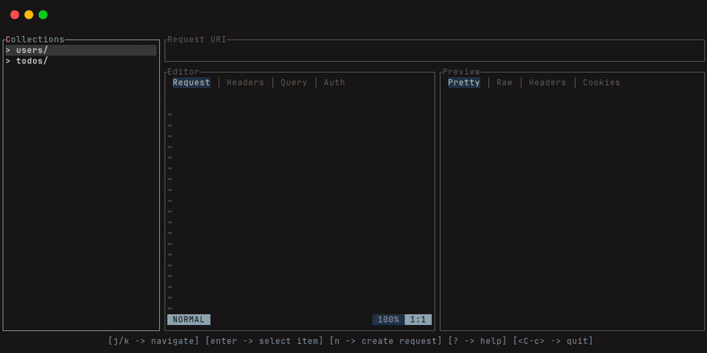
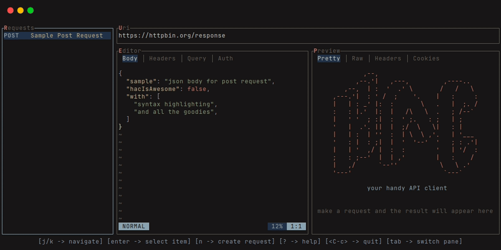
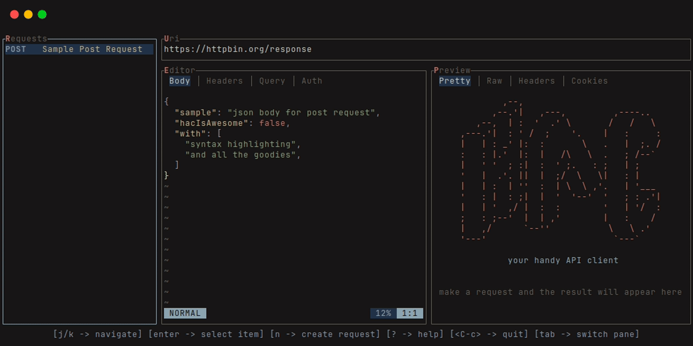

<div align="center">

            ,--,                          
          ,--.'|   ,---,         ,----..  
       ,--,  | :  '  .' \       /   /   \ 
    ,---.'|  : ' /  ;    '.    |   :     :
    |   | : _' |:  :       \   .   |  ;. /
    :   : |.'  |:  |   /\   \  .   ; /--` 
    |   ' '  ; :|  :  ' ;.   : ;   | ;    
    '   |  .'. ||  |  ;/  \   \|   : |    
    |   | :  | ''  :  | \  \ ,'.   | '___ 
    '   : |  : ;|  |  '  '--'  '   ; : .'|
    |   | '  ,/ |  :  :        '   | '/  :
    ;   : ;--'  |  | ,'        |   :    / 
    |   ,/      `--''           \   \ .'  
    '---'                        `---`    


A handy API client for your terminal!

</div>

<hr />

`HAC` is an API client like Postman that runs on your terminal. We have the
goal of making easy to test and document APIs while being completely offline,
free and open source.



<details>
<summary>Expand to see more examples</summary>





</details>

## Table of contents
- [Try it](#try-it)
- [Installation](#installation)
- [Documentation](#usage)
- [Customization](#customization)
- [Contributing](#contributing)
- [Changelog](#changelog)

## Try it

### Nix ❄️

If you already have Nix setup with flake support, you can try out hac with the
nix run command:

```sh
nix run github:wllfaria/hac
```

Nix will build and run hac.

If you want to pass arguments this way, use e.g. `nix run github:wllfaria/hac -- -h`

## Installation

This section should guide you through the hac installation process.

You can get hac with cargo, or get the latest release [tag](https://github.com/wllfaria/hac/tags).

### Installing with cargo

> [!NOTE]
> you need rust v1.76 or newer

You can get hac from crates.io with:

```sh
cargo install hac-client
```

### Building from source

Clone the repository into your machine, and you'll be able to run, or build by 
following the steps below:

```sh
git clone https://github.com/wllfaria/hac
cd hac
cargo run

# alternatively, you can run:
cargo build --release
# or if you have just:
just build
# the binary will be located at target/release/hac
```

> [!IMPORTANT]
> hac is in its very early stages of development, new features are added constantly,
> and we have many features planned, feel free to report any bugs, ask for features or
> discuss ideas.

## Documentation

> [!NOTE]
> Documentation is still a work in progress

Documentation can be found in the [hac wiki](https://github.com/wllfaria/hac/wiki)

## Customization

Customizing hac is as simple as editing toml files on the config directory, which can
be in different places based on your system and maybe in your environment variables, but
you can run the following command to know where hac is looking for your configuration:

```sh
# this command will print the path to the configuration directory hac is trying to load
hac --config-dir
```

> [!NOTE]
> You can check all the configuration options and what they mean in the wiki secion
> for customizing hac

hac comes with a set of default configurations, you can check more on the
[wiki](https://github.com/wllfaria/hac/wiki), or if you prefer, you can dump the default
configuration and colorscheme to the configuration directory by using:

```sh
hac --config-dump
```

> [!TIP]
> If you want to save the config to a file, you can do as follows.

```sh
hac --config-dump > hac.toml
```

## Contributing

All contributions are welcome! Just open a pull request. Please read [CONTRIBUTING.md](./CONTRIBUTING.md)

## Changelog

Changelogs can be found [here](./CHANGELOG.md)
